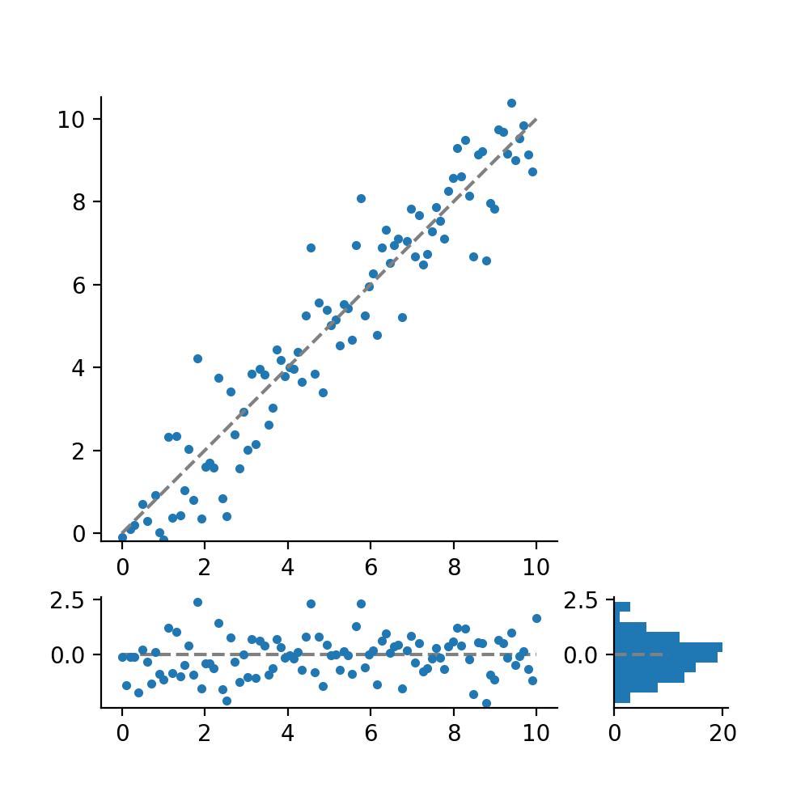
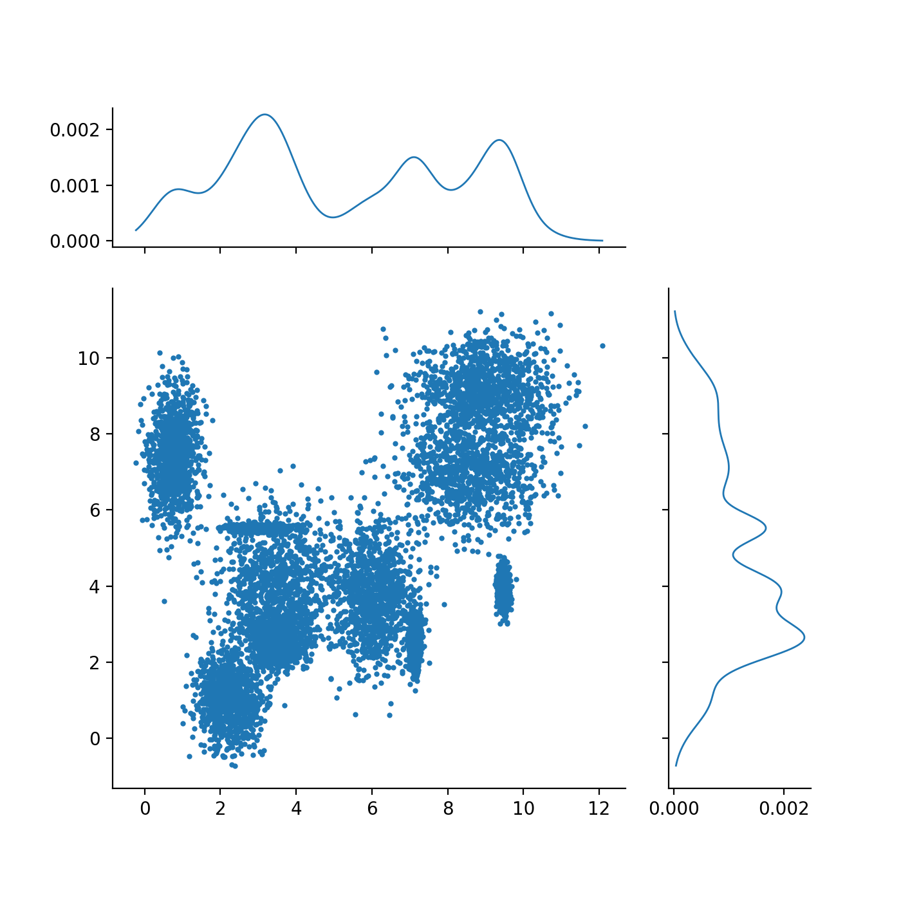

# ZSPlot

Matplotlib plots that I find myself constantly making. I'm compiling them into a
repository for quick call.


## Examples

### Correlation plot

```python
import zsplot
import numpy as np

x = np.linspace(0, 10, 100)
y = x + np.random.randn(len(x))

zsplot.corr_resid_rhist(x,y, figsize=(5,5))
```



### KDE Plot

```python
import zsplot
import numpy as np

n_gaussians = 10
n_points = 1000

x = np.zeros(n_gaussians*n_points)
y = np.zeros(n_gaussians*n_points)

for i in range(n_gaussians):

    xcenter = np.random.uniform(0,10)
    ycenter = np.random.uniform(0,10)
    xwidth = np.random.rand()
    ywidth = np.random.rand()

    x_sample = np.random.normal(loc=xcenter, scale=xwidth, size=n_points)
    y_sample = np.random.normal(loc=ycenter, scale=ywidth, size=n_points)

    x[i*n_points:(i+1)*n_points] = x_sample
    y[i*n_points:(i+1)*n_points] = y_sample


zsplot.kde2d(x,y, markersize=2)
```


